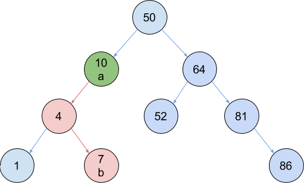

# Laboratorio 2


## Problema 1


Dado un arreglo de números de largo `N`, que corresponde al output de un recorrido
en pre-order de un arbol de busqueda binaria. Se le pide volver a generar dicho árbol.


Para los nodos del árbol, utilice la siguiente estructura:


```
type node struct {
	value int
	left *node
	right *node
}
```


Esto quiere decir, que si usted recibe como input el siguiente arreglo:


`[50, 10, 4, 1, 7, 64, 52, 81, 86]`


Usted debe generar un árbol como este:


## Problema 2


Tomando en cuenta el árbol construido en la solución del problema anterior, más dos valores `a` y `b` contenidos en el mismo. Se le solicita que responda si acaso `a` es un ancestro de `b`. Esto es, si ocurre que `b` existe en algún sub-árbol de `a`





Como ejemplo, usted puede observar que 10 es un ancestro de 7, ya que 7, se encuentra en un sub-árbol de 10.


## Problema 3


Usted nuevamente recibirá dos valores `a` y `b`, contenidos dentro de su árbol previamente construido. Pero esta vez, debe responder cuál es el antepasado común más bajo, también conocido como el lowest common ancestor (LCA). Esto quiere decir que usted debe encontrar el antepasado común entre ambos valores que se encuentre lo más cercano posible a ellos. La siguiente figura muestra el LCA entre los valores 52 y 86.


Cómo se logra observar, 64 es un ancestro para ambos valores. Tome en cuenta que 50 también es una respuesta válida, pero queda descartado ya que 64 es un ancestro más bajo, o en otras palabras, es el ancestro que más cerca esta de ambos.


### Formato de entrada


La primera línea de entrada contendrá un número `N`. Inmediatamente le seguirán N números separados por espacios en blanco, los cuales corresponden al contenido del arreglo en pre-order del arbol de busqueda binaria que usted debe reconstruir.


Paso seguido, le seguirán N líneas, la cuales siguen el siguiente esquema


- Cada línea tendrá dos valores numéricos `a` y `b`, los cuales estarán separados por un espacio en blanco. Para cada uno de estos pares usted deberá responder si acaso `a` es un ancestro de `b` y a su vez, cual es el LCA entre `a` y `b`.


### Restricciones


1 ≤ `N` ≤ 10000


-10000 ≤ `a` ≤ 10000


-10000 ≤ `b` ≤ 10000


### Formato de salida


Usted deberá imprimir `N` líneas, donde cada línea contendrá lo siguiente:


- El resultado de consultar si `a` es el ancestro de `b`, en donde deberá responder `true` en caso de que si lo sea, y `false` en caso de que no.
- Un espacio en blanco separador.
- El resultado de consultar el LCA entre el par `a,b`. Dado que se le asegura que los valores si existirán dentro del árbol, siempre será posible encontrar una respuesta.


### Ejemplo


#### Entrada


```
9
50 10 4 1 7 64 52 81 86
1 7
1 52
4 10
50 86
81 4
7 1
64 52
52 10
52 86
```


#### Salida


```
false 4
false 50
false 10
true 50
false 50
false 4
true 64
false 50
false 50
```
