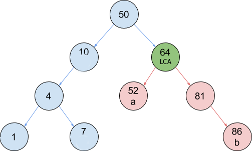

# Laboratorio 2


## Problema 1


Dado un arreglo de números de largo `N`, que corresponde al output de un recorrido
en pre-order de un arbol de busqueda binaria (BST). Se le pide volver a generar dicho árbol.


Para los nodos del árbol, utilice la siguiente estructura:


```
type node struct {
	value int
	left *node
	right *node
}
```


Esto quiere decir, que si usted recibe como input el siguiente arreglo:


`[50, 10, 4, 1, 7, 64, 52, 81, 86]`


Usted debe generar un árbol como este:


## Problema 2


Usted recibirá dos valores `a` y `b`, contenidos dentro de su árbol previamente construido. Usted deberá encontrar la mínima distancia
entre los nodos `a` y `b`. Para esto es útil poder detectar cual es el antepasado común más bajo, también conocido como el *lowest
common ancestor* (LCA).

El LCA es el antepasado común entre ambos valores que se encuentre lo más cercano posible a ellos. La siguiente figura muestra el LCA
entre los valores 52 y 86.





Cómo se logra observar, 64 es un ancestro para ambos valores. Tome en cuenta que 50 también es una respuesta válida, pero queda descartado
ya que 64 es un ancestro más bajo, o en otras palabras, es el ancestro que más cerca esta de ambos.

Lo que se pide encontrar es la mínima distancia entre ambos nodos, y como se puede observar ésta es igual a la suma de las distancias de
ambos nodos hacia su antecesor comun más bajo. En el ejemplo anterior la distancia mínima entre `a`  y `b` corresponde a 3, ya que la distancia
entre el nodo  `a` y el antecesor comun más bajo es 1 y la distancia entre el nodo `b` y el antecesor comun más bajo es 2.

### Formato de entrada


La primera línea de entrada contendrá un número `N`. Inmediatamente le seguirán N números separados por espacios en blanco,
los cuales corresponden al contenido del arreglo en pre-order del arbol de busqueda binaria que usted debe reconstruir.

Paso seguido, le seguirán N líneas, la cuales siguen el siguiente esquema


- Cada línea tendrá dos valores numéricos `a` y `b`, los cuales estarán separados por un espacio en blanco.
Para cada uno de estos pares usted deberá responder la distancia mínima entre los nodos `a` y `b`.


### Restricciones


1 ≤ `N` ≤ 10000


-10000 ≤ `a` ≤ 10000


-10000 ≤ `b` ≤ 10000


### Formato de salida


Usted deberá imprimir `N` líneas, donde cada línea contendrá un solo número que corresponde a la distancia mínima entre los
nodos `a` y `b`.


### Ejemplo


#### Entrada


```
9
50 10 4 1 7 64 52 81 86
1 7
1 52
4 10
50 86
81 4
7 1
64 52
52 10
52 86
```


#### Salida


```
2
5
1
3
4
2
1
3
3
```
